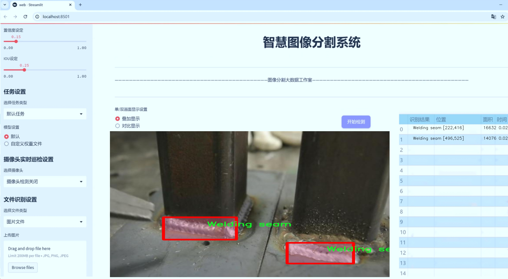
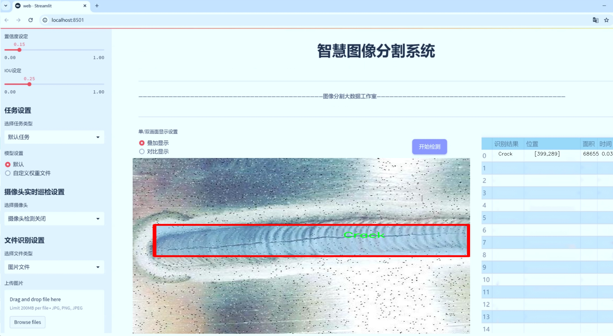
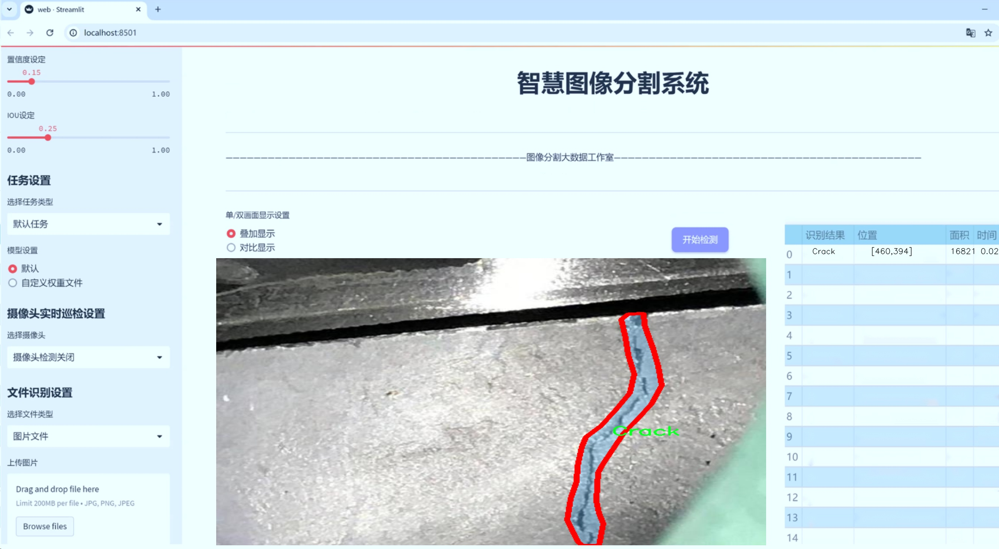
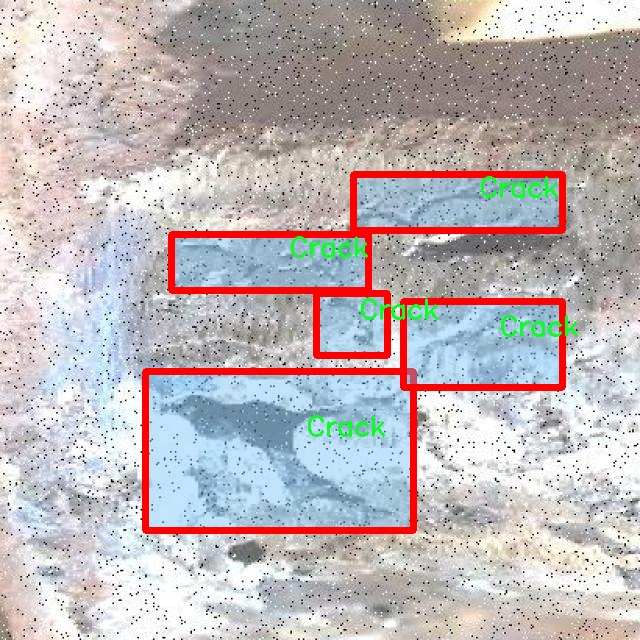
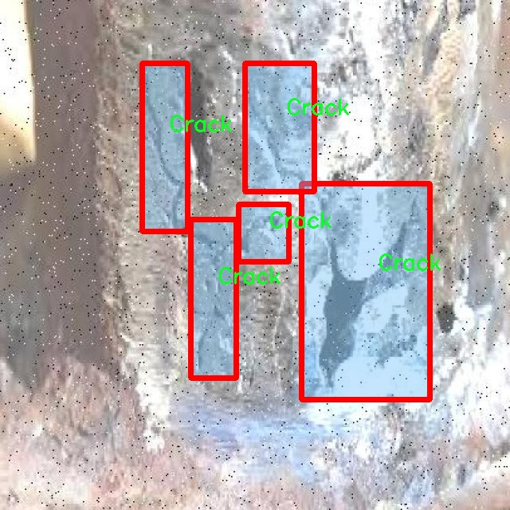
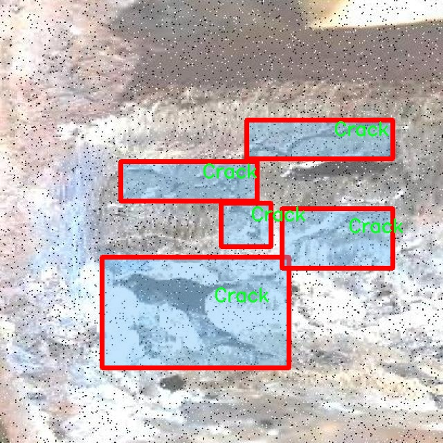
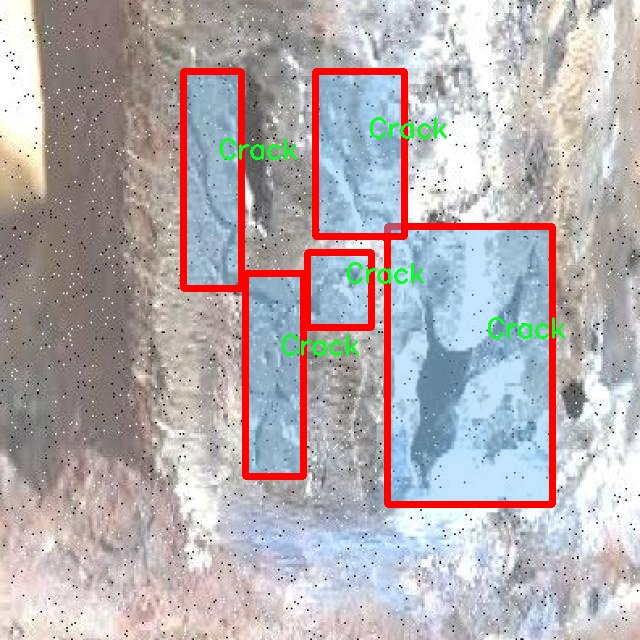

# 焊接质量缺陷分割系统源码＆数据集分享
 [yolov8-seg-C2f-DWR＆yolov8-seg-RevCol等50+全套改进创新点发刊_一键训练教程_Web前端展示]

### 1.研究背景与意义

项目参考[ILSVRC ImageNet Large Scale Visual Recognition Challenge](https://gitee.com/YOLOv8_YOLOv11_Segmentation_Studio/projects)

项目来源[AAAI Global Al lnnovation Contest](https://kdocs.cn/l/cszuIiCKVNis)

研究背景与意义

焊接作为一种广泛应用于制造业的重要连接工艺，其质量直接影响到产品的安全性和可靠性。随着工业自动化和智能制造的不断发展，传统的焊接质量检测方法逐渐暴露出效率低、主观性强和难以实现实时监控等缺陷。因此，亟需一种高效、准确的焊接质量缺陷检测技术，以提升焊接工艺的整体水平和产品质量。近年来，深度学习技术的迅猛发展为焊接质量检测提供了新的解决方案，尤其是基于卷积神经网络（CNN）的目标检测和分割算法，已在多个领域取得了显著的成果。

YOLO（You Only Look Once）系列算法以其高效的实时检测能力和较高的准确率，成为目标检测领域的研究热点。YOLOv8作为该系列的最新版本，进一步提升了模型的检测精度和速度，适用于复杂环境下的实时检测任务。然而，针对焊接质量缺陷的特定需求，YOLOv8仍需进行一定的改进，以更好地适应焊接图像的特征和缺陷类型。因此，基于改进YOLOv8的焊接质量缺陷分割系统的研究具有重要的理论和实践意义。

本研究所使用的数据集“焊接质量检测2”包含3700幅图像，涵盖了五类焊接缺陷：裂纹、过量焊料、气孔、飞溅和焊缝。这些缺陷不仅影响焊接接头的强度和耐久性，还可能导致产品在使用过程中的失效。因此，准确识别和分割这些缺陷，对于提高焊接质量和降低生产成本具有重要意义。通过对这些缺陷进行有效的实例分割，可以为后续的自动化检测和质量控制提供可靠的数据支持。

在此背景下，改进YOLOv8的焊接质量缺陷分割系统将采用先进的深度学习技术，结合焊接缺陷的特征，设计出适合于焊接图像的网络结构和训练策略。通过对模型的优化和调试，期望能够实现对焊接缺陷的高精度检测和分割，进而提升焊接质量检测的自动化水平和智能化程度。此外，研究成果将为焊接行业提供一种新的检测工具，推动焊接技术的进步和应用。

综上所述，基于改进YOLOv8的焊接质量缺陷分割系统的研究，不仅具有重要的学术价值，还对实际生产中的焊接质量控制具有深远的影响。通过本研究，期望能够为焊接行业提供更为高效、准确的质量检测手段，促进智能制造的发展，为提升产品质量和保障使用安全贡献力量。

### 2.图片演示







##### 注意：由于此博客编辑较早，上面“2.图片演示”和“3.视频演示”展示的系统图片或者视频可能为老版本，新版本在老版本的基础上升级如下：（实际效果以升级的新版本为准）

  （1）适配了YOLOV8的“目标检测”模型和“实例分割”模型，通过加载相应的权重（.pt）文件即可自适应加载模型。

  （2）支持“图片识别”、“视频识别”、“摄像头实时识别”三种识别模式。

  （3）支持“图片识别”、“视频识别”、“摄像头实时识别”三种识别结果保存导出，解决手动导出（容易卡顿出现爆内存）存在的问题，识别完自动保存结果并导出到tempDir中。

  （4）支持Web前端系统中的标题、背景图等自定义修改，后面提供修改教程。

  另外本项目提供训练的数据集和训练教程,暂不提供权重文件（best.pt）,需要您按照教程进行训练后实现图片演示和Web前端界面演示的效果。

### 3.视频演示

[3.1 视频演示](https://www.bilibili.com/video/BV1oa2PYhE1L/)

### 4.数据集信息展示

##### 4.1 本项目数据集详细数据（类别数＆类别名）

nc: 5
names: ['Crack', 'Excess Reinforcement', 'Porosity', 'Spatters', 'Welding seam']


##### 4.2 本项目数据集信息介绍

数据集信息展示

在焊接质量检测领域，准确识别和分割焊接缺陷是确保焊接结构安全性和可靠性的关键环节。为此，我们采用了名为“Weld quality inspection 2”的数据集，以训练和改进YOLOv8-seg模型，从而实现对焊接质量缺陷的高效分割和检测。该数据集专注于焊接过程中可能出现的多种缺陷，涵盖了五个主要类别，分别为裂纹（Crack）、过量增强（Excess Reinforcement）、孔隙（Porosity）、飞溅（Spatters）和焊缝（Welding seam）。这些类别不仅反映了焊接工艺中常见的问题，也为模型的训练提供了丰富的样本和多样化的特征。

“Weld quality inspection 2”数据集的设计考虑到了焊接缺陷的多样性和复杂性。每个类别的样本均经过精心标注，确保了数据的准确性和可靠性。裂纹是焊接过程中最常见的缺陷之一，通常由于焊接热影响区的应力集中而形成。该类别的样本展示了不同类型和形状的裂纹，为模型提供了多样的学习基础。过量增强则是指焊接过程中材料的过度堆积，可能导致结构强度的降低。数据集中包含了多种角度和光照条件下的过量增强实例，帮助模型更好地理解这一缺陷的特征。

孔隙缺陷通常是由于焊接过程中气体未能有效逸出而形成的，可能影响焊接接头的完整性和强度。数据集中包含了不同大小和分布的孔隙样本，使得模型能够学习到如何在复杂背景下识别这一缺陷。飞溅则是焊接过程中熔融金属飞溅到周围区域所形成的颗粒，可能影响焊接接头的外观和性能。该类别的样本多样性为模型提供了丰富的训练数据，增强了其对飞溅现象的识别能力。最后，焊缝作为焊接过程的核心部分，其质量直接关系到焊接接头的强度和耐久性。数据集中包含了多种焊缝形态的样本，帮助模型在识别焊接缺陷时能够更好地理解焊缝的正常特征。

总的来说，“Weld quality inspection 2”数据集为焊接质量缺陷的检测和分割提供了一个全面的基础。通过对五个类别的深入学习，YOLOv8-seg模型将能够在实际应用中实现高效、准确的焊接缺陷识别。这不仅提高了焊接质量检测的自动化水平，也为后续的焊接工艺改进提供了数据支持和理论依据。随着数据集的不断扩展和模型的持续优化，我们期待在焊接质量检测领域取得更大的突破，推动智能制造和工业自动化的发展。










### 5.全套项目环境部署视频教程（零基础手把手教学）

[5.1 环境部署教程链接（零基础手把手教学）](https://www.bilibili.com/video/BV1jG4Ve4E9t/?vd_source=bc9aec86d164b67a7004b996143742dc)


[5.2 安装Python虚拟环境创建和依赖库安装视频教程链接（零基础手把手教学）](https://www.bilibili.com/video/BV1nA4VeYEze/?vd_source=bc9aec86d164b67a7004b996143742dc)

### 6.手把手YOLOV8-seg训练视频教程（零基础小白有手就能学会）

[6.1 手把手YOLOV8-seg训练视频教程（零基础小白有手就能学会）](https://www.bilibili.com/video/BV1cA4VeYETe/?vd_source=bc9aec86d164b67a7004b996143742dc)


按照上面的训练视频教程链接加载项目提供的数据集，运行train.py即可开始训练



     Epoch   gpu_mem       box       obj       cls    labels  img_size
     1/200     0G   0.01576   0.01955  0.007536        22      1280: 100%|██████████| 849/849 [14:42<00:00,  1.04s/it]
               Class     Images     Labels          P          R     mAP@.5 mAP@.5:.95: 100%|██████████| 213/213 [01:14<00:00,  2.87it/s]
                 all       3395      17314      0.994      0.957      0.0957      0.0843

     Epoch   gpu_mem       box       obj       cls    labels  img_size
     2/200     0G   0.01578   0.01923  0.007006        22      1280: 100%|██████████| 849/849 [14:44<00:00,  1.04s/it]
               Class     Images     Labels          P          R     mAP@.5 mAP@.5:.95: 100%|██████████| 213/213 [01:12<00:00,  2.95it/s]
                 all       3395      17314      0.996      0.956      0.0957      0.0845

     Epoch   gpu_mem       box       obj       cls    labels  img_size
     3/200     0G   0.01561    0.0191  0.006895        27      1280: 100%|██████████| 849/849 [10:56<00:00,  1.29it/s]
               Class     Images     Labels          P          R     mAP@.5 mAP@.5:.95: 100%|███████   | 187/213 [00:52<00:00,  4.04it/s]
                 all       3395      17314      0.996      0.957      0.0957      0.0845


### 7.50+种全套YOLOV8-seg创新点代码加载调参视频教程（一键加载写好的改进模型的配置文件）

[7.1 50+种全套YOLOV8-seg创新点代码加载调参视频教程（一键加载写好的改进模型的配置文件）](https://www.bilibili.com/video/BV1Hw4VePEXv/?vd_source=bc9aec86d164b67a7004b996143742dc)

### 8.YOLOV8-seg图像分割算法原理

原始YOLOv8-seg算法原理

YOLOv8-seg算法是YOLO系列中的一个重要进展，专注于目标检测与分割任务的结合，展现了高效性与精确性的完美平衡。作为一种一阶段目标检测算法，YOLOv8-seg不仅继承了YOLO系列的优良传统，还在网络结构、特征提取和任务解耦等方面进行了深度优化，使其在复杂场景下的表现更加出色。

首先，YOLOv8-seg的网络结构由主干网络（backbone）、特征增强网络（neck）和检测头（head）三部分组成。主干网络采用了CSPDarknet结构，旨在通过分阶段的残差学习提高特征提取的效率和准确性。CSPDarknet的设计理念在于将特征图分为多个分支，允许网络在不同的层次上进行特征提取，进而捕捉到更丰富的上下文信息。这种结构的引入，不仅提升了模型的表达能力，还有效减少了计算量，确保了实时检测的需求。

在特征增强网络方面，YOLOv8-seg引入了快速空间金字塔池化（SPPF）和路径聚合网络（PAN），这两者的结合使得模型能够在多尺度特征上进行有效的融合与增强。SPPF通过对特征图进行不同尺度的池化，能够提取出更为丰富的特征信息，适应各种目标的大小变化。而PAN则通过对特征图的多层次聚合，进一步提升了模型对复杂场景的适应能力。这种多层次的特征处理方式，使得YOLOv8-seg在处理复杂背景和不同目标时，能够保持较高的检测精度。

YOLOv8-seg的检测头采用了解耦结构，将目标的分类与定位任务分开处理。传统的YOLO系列模型通常将这两个任务耦合在一起，导致在复杂场景下可能出现定位不准或分类错误的问题。而通过解耦，YOLOv8-seg能够使每个任务更加专注于自身的目标，进而提升整体的检测性能。这种解耦设计不仅优化了模型的训练过程，还提高了推理速度，使得YOLOv8-seg在实时应用中表现更加优异。

值得一提的是，YOLOv8-seg采用了无锚框（Anchor-Free）目标检测方法。这一创新的检测方式不再依赖于预定义的锚框，而是通过回归的方式直接预测目标的位置和大小。这种方法的优势在于，网络能够更快地聚焦于目标位置的邻近点，减少了锚框选择和调整的复杂性，从而提高了检测的速度和准确度。此外，无锚框方法使得YOLOv8-seg在处理不同尺度和形状的目标时，能够更灵活地适应变化，提升了模型的泛化能力。

在分割任务方面，YOLOv8-seg通过引入像素级的预测能力，使得模型不仅能够识别目标的类别和位置，还能够精确地分割出目标的轮廓。这一特性使得YOLOv8-seg在诸如自动驾驶、智能监控和机器人视觉等应用场景中，展现出更为广泛的适用性。通过对图像进行全局上下文的理解，YOLOv8-seg能够在复杂环境中实现高效的目标分割，提升了视觉系统的智能化水平。

YOLOv8-seg的训练过程同样经过了精心设计。通过引入更为复杂的损失函数，模型能够在训练过程中更好地平衡分类与定位的准确性。此外，YOLOv8-seg还采用了数据增强技术，以提升模型对不同场景和条件的适应能力。这些优化措施不仅提高了模型的鲁棒性，还使得YOLOv8-seg在面对真实世界中的复杂任务时，能够保持高效的性能。

总之，YOLOv8-seg算法通过对网络结构的深度优化、特征提取的多层次增强、任务的解耦处理以及无锚框检测方法的引入，展现了其在目标检测与分割领域的强大能力。随着技术的不断进步，YOLOv8-seg将为各类应用场景提供更为精准、高效的解决方案，推动计算机视觉技术的进一步发展。无论是在工业自动化、智能交通还是农业自动化等领域，YOLOv8-seg都将发挥其独特的优势，助力实现更智能的视觉识别与处理。


### 9.系统功能展示（检测对象为举例，实际内容以本项目数据集为准）

图9.1.系统支持检测结果表格显示

  图9.2.系统支持置信度和IOU阈值手动调节

  图9.3.系统支持自定义加载权重文件best.pt(需要你通过步骤5中训练获得)

  图9.4.系统支持摄像头实时识别

  图9.5.系统支持图片识别

  图9.6.系统支持视频识别

  图9.7.系统支持识别结果文件自动保存

  图9.8.系统支持Excel导出检测结果数据


### 10.50+种全套YOLOV8-seg创新点原理讲解（非科班也可以轻松写刊发刊，V11版本正在科研待更新）

#### 10.1 由于篇幅限制，每个创新点的具体原理讲解就不一一展开，具体见下列网址中的创新点对应子项目的技术原理博客网址【Blog】：


[10.1 50+种全套YOLOV8-seg创新点原理讲解链接](https://gitee.com/qunmasj/good)

#### 10.2 部分改进模块原理讲解(完整的改进原理见上图和技术博客链接)【此小节的图要是加载失败请移步原始博客查看，链接：https://blog.csdn.net/cheng2333333?type=blog】

### YOLOv8模型
YOLOv8模型由Ultralytics团队在YOLOv5模型的基础上，吸收了近两年半来经过实际验证的各种改进，于2023年1月提出。与之前的一些YOLO 系列模型想类似，YOLOv8模型也有多种尺寸，下面以YOLOv8n为例，分析 YOLOv8模型的结构和改进点。YOLOv8模型网络结构如
输入图片的部分，由于发现Mosaic数据增强尽管这有助于提升模型的鲁棒性和泛化性，但是，在一定程度上，也会破坏数据的真实分布，使得模型学习到一些不好的信息。所以YOLOv8模型在训练中的最后10个epoch 停止使用Mosaic数据增强。


在网络结构上，首先主干网络的改变不大，主要是将C3模块替换为了C2f模块，该模块的结构在上图中已示出。C2f模块在C3模块的思路基础上，引入了YOLOv7中 ELAN的思路，引入了更多的跳层连接，这有助于该模块获得更丰富的梯度流信息，而且模型的轻量化得到了保证。依然保留了SPPF，效果不变的同时减少了该模块的执行时间。
在颈部网络中，也是将所有的C3模块更改为C2f模块，同时删除了两处上采样之前的卷积连接层。
在头部网络中，采用了YOLOX中使用的解耦头的思路，两条并行的分支分别提取类别和位置特征。由于分类任务更注重于分析特征图中提取到的特征与已输入图片的部分，由于发现 Mosaic数据增强尽管这有助于提升模型的鲁棒性和泛化性，但是，在一定程度上，也会破坏数据的真实分布，使得模型学习到一些不好的信息。所以YOLOv8模型在训练中的最后10个epoch停止使用Mosaic数据增强。
在网络结构上，首先主干网络的改变不大，主要是将C3模块替换为了C2f模块，该模块的结构在上图中已示出。C2f模块在C3模块的思路基础上，引入了YOLOv7中ELAN的思路，引入了更多的跳层连接，这有助于该模块获得更丰富的梯度流信息，而且模型的轻量化得到了保证。依然保留了SPPF，效果不变的同时减少了该模块的执行时间。
在颈部网络中，也是将所有的C3模块更改为C2f模块，同时删除了两处上采样之前的卷积连接层。
在头部网络中，采用了YOLOX中使用的解耦头的思路，两条并行的分支分别提取类别和位置特征。由于分类任务更注重于分析特征图中提取到的特征与已有类别中的哪一种更为相似，而定位任务更关注边界框与真值框的位置关系，并据此对边界框的坐标进行调整。侧重点的不同使得在使用两个检测头时收敛的速度和预测的精度有所提高。而且使用了无锚框结构，直接预测目标的中心，并使用TAL (Task Alignment Learning，任务对齐学习）来区分正负样本，引入了分类分数和IOU的高次幂乘积作为衡量任务对齐程度的指标，认为同时拥有好的定位和分类评价的在分类和定位损失函数中也引入了这项指标。
在模型的检测结果上，YOLOv8模型也取得了较好的成果，图为官方在coCO数据集上 YOLOv8模型的模型尺寸大小和检测的mAP50-95对比图。mAP50-95指的是IOU的值从50%取到95%，步长为5%，然后算在这些IOU下的mAP的均值。图的 a）图展示了YOLOv8在同尺寸下模型中参数没有较大增加的前提下取得了比其他模型更好的精度，图2-17的b)图展示了YOLOv8比其他YOLO系列模型在同尺寸时，推理速度更快且精度没有太大下降。


### 视觉transformer(ViT)简介
视觉transformer(ViT)最近在各种计算机视觉任务中证明了巨大的成功，并受到了相当多的关注。与卷积神经网络(CNNs)相比，ViT具有更强的全局信息捕获能力和远程交互能力，表现出优于CNNs的准确性，特别是在扩大训练数据大小和模型大小时[An image is worth 16x16 words: Transformers for image recognition at scale,Coatnet]。

尽管ViT在低分辨率和高计算领域取得了巨大成功，但在高分辨率和低计算场景下，ViT仍不如cnn。例如，下图(左)比较了COCO数据集上当前基于cnn和基于vit的一级检测器。基于vit的检测器(160G mac)和基于cnn的检测器(6G mac)之间的效率差距超过一个数量级。这阻碍了在边缘设备的实时高分辨率视觉应用程序上部署ViT。


左图:现有的基于vit的一级检测器在实时目标检测方面仍然不如当前基于cnn的一级检测器，需要的计算量多出一个数量级。本文引入了第一个基于vit的实时对象检测器来弥补这一差距。在COCO上，efficientvit的AP比efficientdet高3.8，而mac较低。与YoloX相比，efficient ViT节省67.2%的计算成本，同时提供更高的AP。

中:随着输入分辨率的增加，计算成本呈二次增长，无法有效处理高分辨率的视觉应用。

右图:高分辨率对图像分割很重要。当输入分辨率从1024x2048降低到512x1024时，MobileNetV2的mIoU减少12% (8.5 mIoU)。在不提高分辨率的情况下，只提高模型尺寸是无法缩小性能差距的。

ViT的根本计算瓶颈是softmax注意模块，其计算成本随输入分辨率的增加呈二次增长。例如，如上图(中)所示，随着输入分辨率的增加，vit- small[Pytorch image models. https://github.com/rwightman/ pytorch-image-models]的计算成本迅速显著大于ResNet-152的计算成本。

解决这个问题的一个直接方法是降低输入分辨率。然而，高分辨率的视觉识别在许多现实世界的计算机视觉应用中是必不可少的，如自动驾驶，医疗图像处理等。当输入分辨率降低时，图像中的小物体和精细细节会消失，导致目标检测和语义分割性能显著下降。

上图(右)显示了在cityscape数据集上不同输入分辨率和宽度乘法器下MobileNetV2的性能。例如，将输入分辨率从1024x2048降低到512x1024会使cityscape的性能降低12% (8.5 mIoU)。即使是3.6倍高的mac，只放大模型尺寸而不增加分辨率也无法弥补这一性能损失。

除了降低分辨率外，另一种代表性的方法是限制softmax注意，方法是将其范围限制在固定大小的局部窗口内[Swin transformer,Swin transformer v2]或降低键/值张量的维数[Pyramid vision transformer,Segformer]。然而，它损害了ViT的非局部注意能力，降低了全局接受域(ViT最重要的优点)，使得ViT与大内核cnn的区别更小[A convnet for the 2020s,Scaling up your kernels to 31x31: Revisiting large kernel design in cnns,Lite pose: Efficient architecture design for 2d human pose estimation]。

本文介绍了一个有效的ViT体系结构，以解决这些挑战。发现没有必要坚持softmax注意力。本文建议用线性注意[Transformers are rnns: Fast autoregressive transformers with linear attention]代替softmax注意。

线性注意的关键好处是，它保持了完整的n 2 n^2n 2
 注意映射，就像softmax注意。同时，它利用矩阵乘法的联想特性，避免显式计算完整的注意映射，同时保持相同的功能。因此，它保持了softmax注意力的全局特征提取能力，且计算复杂度仅为线性。线性注意的另一个关键优点是它避免了softmax，这使得它在移动设备上更有效(下图左)。


左图:线性注意比类似mac下的softmax注意快3.3-4.5倍，这是因为去掉了硬件效率不高的softmax功能。延迟是在Qualcomm Snapdragon 855 CPU和TensorFlow-Lite上测量的。本文增加线性注意的头部数量，以确保它具有与softmax注意相似的mac。

中:然而，如果没有softmax注意中使用的非线性注意评分归一化，线性注意无法有效集中其注意分布，削弱了其局部特征提取能力。后文提供了可视化。

右图:本文用深度卷积增强线性注意，以解决线性注意的局限性。深度卷积可以有效地捕捉局部特征，而线性注意可以专注于捕捉全局信息。增强的线性注意在保持线性注意的效率和简单性的同时，表现出在各种视觉任务上的强大表现(图4)。

然而，直接应用线性注意也有缺点。以往的研究表明线性注意和softmax注意之间存在显著的性能差距(下图中间)。


左:高通骁龙855上的精度和延迟权衡。效率vit比效率网快3倍，精度更高。中:ImageNet上softmax注意与线性注意的比较。在相同的计算条件下，本文观察到softmax注意与线性注意之间存在显著的精度差距。而深度卷积增强模型后，线性注意的精度有明显提高。

相比之下，softmax注意的精度变化不大。在相同MAC约束下，增强线性注意比增强软最大注意提高了0.3%的精度。右图:与增强的softmax注意相比，增强的线性注意硬件效率更高，随着分辨率的增加，延迟增长更慢。

深入研究线性注意和softmax注意的详细公式，一个关键的区别是线性注意缺乏非线性注意评分归一化方案。这使得线性注意无法有效地将注意力分布集中在局部模式产生的高注意分数上，从而削弱了其局部特征提取能力。

本文认为这是线性注意的主要限制，使其性能不如softmax注意。本文提出了一个简单而有效的解决方案来解决这一限制，同时保持线性注意在低复杂度和低硬件延迟方面的优势。具体来说，本文建议通过在每个FFN层中插入额外的深度卷积来增强线性注意。因此，本文不需要依赖线性注意进行局部特征提取，避免了线性注意在捕捉局部特征方面的不足，并利用了线性注意在捕捉全局特征方面的优势。

本文广泛评估了efficient vit在低计算预算下对各种视觉任务的有效性，包括COCO对象检测、城市景观语义分割和ImageNet分类。本文想要突出高效的主干设计，所以没有包括任何正交的附加技术(例如，知识蒸馏，神经架构搜索)。尽管如此，在COCO val2017上，efficientvit的AP比efficientdet - d1高2.4倍，同时节省27.9%的计算成本。在cityscape上，efficientvit提供了比SegFormer高2.5个mIoU，同时降低了69.6%的计算成本。在ImageNet上，efficientvit在584M mac上实现了79.7%的top1精度，优于efficientnet - b1的精度，同时节省了16.6%的计算成本。

与现有的以减少参数大小或mac为目标的移动ViT模型[Mobile-former,Mobilevit,NASVit]不同，本文的目标是减少移动设备上的延迟。本文的模型不涉及复杂的依赖或硬件低效操作。因此，本文减少的计算成本可以很容易地转化为移动设备上的延迟减少。

在高通骁龙855 CPU上，efficient vit运行速度比efficientnet快3倍，同时提供更高的ImageNet精度。本文的代码和预训练的模型将在出版后向公众发布。

### Efficient Vision Transformer.
提高ViT的效率对于在资源受限的边缘平台上部署ViT至关重要，如手机、物联网设备等。尽管ViT在高计算区域提供了令人印象深刻的性能，但在针对低计算区域时，它通常不如以前高效的cnn[Efficientnet, mobilenetv3,Once for all: Train one network and specialize it for efficient deployment]。为了缩小差距，MobileViT建议结合CNN和ViT的长处，使用transformer将卷积中的局部处理替换为全局处理。MobileFormer提出了在MobileNet和Transformer之间建立双向桥以实现特征融合的并行化。NASViT提出利用神经架构搜索来搜索高效的ViT架构。

这些模型在ImageNet上提供了极具竞争力的准确性和效率的权衡。然而，它们并不适合高分辨率的视觉任务，因为它们仍然依赖于softmax注意力。


在本节中，本文首先回顾了自然语言处理中的线性注意，并讨论了它的优缺点。接下来，本文介绍了一个简单而有效的解决方案来克服线性注意的局限性。最后，给出了efficient vit的详细架构。

 为可学习投影矩阵。Oi表示矩阵O的第i行。Sim(·，·)为相似度函数。

虽然softmax注意力在视觉和NLP方面非常成功，但它并不是唯一的选择。例如，线性注意提出了如下相似度函数:


其中，φ(·)为核函数。在本工作中，本文选择了ReLU作为内核函数，因为它对硬件来说是友好的。当Sim(Q, K) = φ(Q)φ(K)T时，式(1)可改写为:


线性注意的一个关键优点是，它允许利用矩阵乘法的结合律，在不改变功能的情况下，将计算复杂度从二次型降低到线性型:


除了线性复杂度之外，线性注意的另一个关键优点是它不涉及注意模块中的softmax。Softmax在硬件上效率非常低。避免它可以显著减少延迟。例如，下图(左)显示了softmax注意和线性注意之间的延迟比较。在类似的mac上，线性注意力比移动设备上的softmax注意力要快得多。


#### EfficientViT
Enhancing Linear Attention with Depthwise Convolution

虽然线性注意在计算复杂度和硬件延迟方面优于softmax注意，但线性注意也有局限性。以往的研究[\[Luna: Linear unified nested attention,Random feature attention,Combiner: Full attention transformer with sparse computation cost,cosformer: Rethinking softmax in attention\]](https://afdian.net/item/602b9612927111ee9ec55254001e7c00)表明，在NLP中线性注意和softmax注意之间通常存在显著的性能差距。对于视觉任务，之前的研究[Visual correspondence hallucination,Quadtree attention for vision transformers]也表明线性注意不如softmax注意。在本文的实验中，本文也有类似的观察结果(图中)。


本文对这一假设提出了质疑，认为线性注意的低劣性能主要是由于局部特征提取能力的丧失。如果没有在softmax注意中使用的非线性评分归一化，线性注意很难像softmax注意那样集中其注意分布。下图(中间)提供了这种差异的示例。


在相同的原始注意力得分下，使用softmax比不使用softmax更能集中注意力。因此，线性注意不能有效地聚焦于局部模式产生的高注意分数(下图)，削弱了其局部特征提取能力。


注意图的可视化显示了线性注意的局限性。通过非线性注意归一化，softmax注意可以产生清晰的注意分布，如中间行所示。相比之下，线性注意的分布相对平滑，使得线性注意在捕捉局部细节方面的能力较弱，造成了显著的精度损失。本文通过深度卷积增强线性注意来解决这一限制，并有效提高了准确性。

介绍了一个简单而有效的解决方案来解决这个限制。本文的想法是用卷积增强线性注意，这在局部特征提取中是非常有效的。这样，本文就不需要依赖于线性注意来捕捉局部特征，而可以专注于全局特征提取。具体来说，为了保持线性注意的效率和简单性，本文建议在每个FFN层中插入一个深度卷积，这样计算开销很小，同时极大地提高了线性注意的局部特征提取能力。

#### Building Block

下图(右)展示了增强线性注意的详细架构，它包括一个线性注意层和一个FFN层，在FFN的中间插入深度卷积。


与之前的方法[Swin transformer,Coatnet]不同，本文在efficientvit中没有使用相对位置偏差。相对位置偏差虽然可以改善模型的性能，但它使模型容易受到分辨率变化[Segformer]的影响。多分辨率训练或新分辨率下的测试在检测和分割中很常见。去除相对位置偏差使高效率vit对输入分辨率更加灵活。

与之前低计算CNNs[Mobilenetv2,mobilenetv3]的设计不同，本文为下采样块添加了额外的下采样快捷方式。每个下采样快捷方式由一个平均池和一个1x1卷积组成。在本文的实验中，这些额外的下采样快捷方式可以稳定训练效率，提高性能。

#### Macro Architecture

下图说明了efficientvit的宏观体系结构。它由输入 stem 和4级组成。最近的研究[Coatnet,Levit,Early convolutions help transformers see better]表明在早期阶段使用卷积对ViT更好。本文遵循这个设计，在第三阶段开始使用增强的线性注意。


EfficientViT宏观架构。本文从第三阶段开始使用增强的线性注意。P2、P3和P4形成了一个金字塔特征图，用于检测和分割。P4用于分类。

为了突出高效的主干本身，本文对MBConv和FFN使用相同的扩展比e (e = 4)保持超参数简单，对所有深度卷积使用相同的内核大小k(除了输入stem)，对所有层使用相同的激活函数(hard swish)。

P2、P3和P4表示阶段2、3和4的输出，形成了特征图的金字塔。本文按照惯例将P2、P3和P4送至检测头。本文使用Yolov8进行检测。为了分割，本文融合了P2和P4。融合特征被馈送到一个轻量级头，包括几个卷积层，遵循Fast-SCNN。为了分类，本文将P4输入到轻量级头部，与MobileNetV3相同。


### 11.项目核心源码讲解（再也不用担心看不懂代码逻辑）

#### 11.1 ultralytics\models\sam\modules\decoders.py

以下是经过简化和注释的核心代码部分，保留了 `MaskDecoder` 和 `MLP` 类的主要功能，并对每个部分进行了详细的中文注释。

```python
import torch
from torch import nn
from torch.nn import functional as F
from typing import List, Tuple, Type

class MaskDecoder(nn.Module):
    """
    用于生成掩码及其质量评分的解码器模块，使用变换器架构根据图像和提示嵌入预测掩码。
    """

    def __init__(
        self,
        *,
        transformer_dim: int,  # 变换器模块的通道维度
        transformer: nn.Module,  # 用于预测掩码的变换器模块
        num_multimask_outputs: int = 3,  # 预测的掩码数量
        activation: Type[nn.Module] = nn.GELU,  # 上采样时使用的激活函数
        iou_head_depth: int = 3,  # 预测掩码质量的MLP深度
        iou_head_hidden_dim: int = 256,  # 预测掩码质量的MLP隐藏维度
    ) -> None:
        super().__init__()
        self.transformer_dim = transformer_dim
        self.transformer = transformer
        self.num_multimask_outputs = num_multimask_outputs

        # IoU token和掩码token的嵌入
        self.iou_token = nn.Embedding(1, transformer_dim)
        self.mask_tokens = nn.Embedding(num_multimask_outputs + 1, transformer_dim)

        # 输出上采样网络
        self.output_upscaling = nn.Sequential(
            nn.ConvTranspose2d(transformer_dim, transformer_dim // 4, kernel_size=2, stride=2),
            nn.LayerNorm(transformer_dim // 4),
            activation(),
            nn.ConvTranspose2d(transformer_dim // 4, transformer_dim // 8, kernel_size=2, stride=2),
            activation(),
        )

        # 生成掩码的超网络MLP
        self.output_hypernetworks_mlps = nn.ModuleList([
            MLP(transformer_dim, transformer_dim, transformer_dim // 8, 3) for _ in range(num_multimask_outputs + 1)
        ])

        # 预测掩码质量的MLP
        self.iou_prediction_head = MLP(transformer_dim, iou_head_hidden_dim, num_multimask_outputs + 1, iou_head_depth)

    def forward(
        self,
        image_embeddings: torch.Tensor,  # 图像编码器的嵌入
        image_pe: torch.Tensor,  # 图像嵌入的位置信息
        sparse_prompt_embeddings: torch.Tensor,  # 稀疏提示的嵌入
        dense_prompt_embeddings: torch.Tensor,  # 密集提示的嵌入
        multimask_output: bool,  # 是否返回多个掩码
    ) -> Tuple[torch.Tensor, torch.Tensor]:
        """
        根据图像和提示嵌入预测掩码。
        """
        masks, iou_pred = self.predict_masks(
            image_embeddings=image_embeddings,
            image_pe=image_pe,
            sparse_prompt_embeddings=sparse_prompt_embeddings,
            dense_prompt_embeddings=dense_prompt_embeddings,
        )

        # 根据需要选择输出的掩码
        mask_slice = slice(1, None) if multimask_output else slice(0, 1)
        masks = masks[:, mask_slice, :, :]
        iou_pred = iou_pred[:, mask_slice]

        return masks, iou_pred

    def predict_masks(
        self,
        image_embeddings: torch.Tensor,
        image_pe: torch.Tensor,
        sparse_prompt_embeddings: torch.Tensor,
        dense_prompt_embeddings: torch.Tensor,
    ) -> Tuple[torch.Tensor, torch.Tensor]:
        """
        预测掩码。
        """
        # 连接输出tokens
        output_tokens = torch.cat([self.iou_token.weight, self.mask_tokens.weight], dim=0)
        output_tokens = output_tokens.unsqueeze(0).expand(sparse_prompt_embeddings.size(0), -1, -1)
        tokens = torch.cat((output_tokens, sparse_prompt_embeddings), dim=1)

        # 扩展每张图像的数据以适应每个掩码
        src = torch.repeat_interleave(image_embeddings, tokens.shape[0], dim=0)
        src = src + dense_prompt_embeddings
        pos_src = torch.repeat_interleave(image_pe, tokens.shape[0], dim=0)

        # 运行变换器
        hs, src = self.transformer(src, pos_src, tokens)
        iou_token_out = hs[:, 0, :]  # IoU token的输出
        mask_tokens_out = hs[:, 1:(1 + self.num_multimask_outputs), :]  # 掩码tokens的输出

        # 上采样掩码嵌入并预测掩码
        src = src.transpose(1, 2).view(src.shape[0], src.shape[1], -1)
        upscaled_embedding = self.output_upscaling(src)
        hyper_in_list: List[torch.Tensor] = [
            self.output_hypernetworks_mlps[i](mask_tokens_out[:, i, :]) for i in range(self.num_multimask_outputs + 1)
        ]
        hyper_in = torch.stack(hyper_in_list, dim=1)
        masks = (hyper_in @ upscaled_embedding.view(upscaled_embedding.shape[0], -1)).view(upscaled_embedding.shape[0], -1, upscaled_embedding.shape[2], upscaled_embedding.shape[3])

        # 生成掩码质量预测
        iou_pred = self.iou_prediction_head(iou_token_out)

        return masks, iou_pred


class MLP(nn.Module):
    """
    多层感知机（MLP）模型。
    """

    def __init__(
        self,
        input_dim: int,  # 输入特征的维度
        hidden_dim: int,  # 隐藏层的维度
        output_dim: int,  # 输出层的维度
        num_layers: int,  # 隐藏层的数量
        sigmoid_output: bool = False,  # 是否对输出层应用sigmoid激活
    ) -> None:
        super().__init__()
        self.num_layers = num_layers
        h = [hidden_dim] * (num_layers - 1)  # 隐藏层维度列表
        self.layers = nn.ModuleList(nn.Linear(n, k) for n, k in zip([input_dim] + h, h + [output_dim]))
        self.sigmoid_output = sigmoid_output

    def forward(self, x):
        """执行前向传播并应用激活函数。"""
        for i, layer in enumerate(self.layers):
            x = F.relu(layer(x)) if i < self.num_layers - 1 else layer(x)
        if self.sigmoid_output:
            x = torch.sigmoid(x)  # 如果需要，应用sigmoid激活
        return x
```

### 代码说明：
1. **MaskDecoder 类**：
   - 主要用于生成掩码和预测掩码质量，利用变换器架构。
   - 初始化时定义了多个嵌入层、上采样网络和用于掩码质量预测的MLP。
   - `forward` 方法处理输入并返回预测的掩码和质量评分。
   - `predict_masks` 方法负责具体的掩码预测逻辑。

2. **MLP 类**：
   - 实现了一个简单的多层感知机，用于特征的前向传播。
   - 可以选择在输出层应用sigmoid激活函数。 

这些代码片段是实现掩码生成和质量预测的核心部分，保留了主要功能并进行了详细注释。

这个文件定义了一个名为 `MaskDecoder` 的类，它是一个用于生成图像掩码及其质量评分的解码器模块，采用了变换器（Transformer）架构。该类的主要功能是根据图像和提示嵌入（prompt embeddings）来预测掩码。

在 `MaskDecoder` 类的构造函数中，首先初始化了一些重要的属性，包括变换器的通道维度、变换器模块本身、要预测的掩码数量、IoU（Intersection over Union）标记的嵌入、掩码标记的嵌入以及输出上采样的神经网络序列。输出上采样的过程使用了反卷积层和层归一化，并应用了激活函数。接着，构造了一个多层感知机（MLP）列表，用于生成掩码，并且定义了一个用于预测掩码质量的MLP。

`forward` 方法是该类的核心，接收图像嵌入、位置编码、稀疏提示嵌入和密集提示嵌入等参数。它调用 `predict_masks` 方法来生成掩码和IoU预测，然后根据是否需要多掩码输出来选择合适的掩码和IoU预测，最后返回这些结果。

`predict_masks` 方法负责具体的掩码预测过程。它首先将IoU标记和掩码标记的嵌入连接在一起，并与稀疏提示嵌入合并。接着，扩展图像嵌入以适应每个掩码，并将其与密集提示嵌入相加。然后，将数据传入变换器中进行处理，得到IoU标记和掩码标记的输出。之后，通过上采样和MLP处理生成最终的掩码，并通过IoU预测头生成掩码质量的预测。

此外，文件中还定义了一个 `MLP` 类，表示一个多层感知机模型。该类的构造函数接受输入维度、隐藏层维度、输出维度和层数等参数，并构建相应的线性层。`forward` 方法则执行前向传播，并在最后一层应用激活函数（如果需要的话）。

整体来看，这个文件实现了一个基于变换器的掩码解码器，能够有效地处理图像和提示信息，以生成高质量的掩码及其对应的质量评分。

#### 11.2 ui.py

```python
import sys
import subprocess

def run_script(script_path):
    """
    使用当前 Python 环境运行指定的脚本。

    Args:
        script_path (str): 要运行的脚本路径

    Returns:
        None
    """
    # 获取当前 Python 解释器的路径
    python_path = sys.executable

    # 构建运行命令
    command = f'"{python_path}" -m streamlit run "{script_path}"'

    # 执行命令
    result = subprocess.run(command, shell=True)
    if result.returncode != 0:
        print("脚本运行出错。")


# 实例化并运行应用
if __name__ == "__main__":
    # 指定您的脚本路径
    script_path = "web.py"  # 这里可以直接指定脚本路径

    # 运行脚本
    run_script(script_path)
```

### 代码核心部分及注释

1. **导入必要的模块**：
   - `sys`：用于访问与 Python 解释器相关的变量和函数。
   - `subprocess`：用于执行外部命令和程序。

2. **定义 `run_script` 函数**：
   - 该函数接收一个脚本路径作为参数，并使用当前 Python 环境来运行该脚本。

3. **获取当前 Python 解释器的路径**：
   - `python_path = sys.executable`：这行代码获取当前正在使用的 Python 解释器的完整路径。

4. **构建运行命令**：
   - `command = f'"{python_path}" -m streamlit run "{script_path}"'`：这行代码构建了一个命令字符串，用于运行指定的脚本。这里使用了 `streamlit` 模块来运行 `web.py` 脚本。

5. **执行命令**：
   - `result = subprocess.run(command, shell=True)`：使用 `subprocess.run` 执行构建的命令。`shell=True` 表示在 shell 中执行命令。

6. **检查命令执行结果**：
   - `if result.returncode != 0:`：检查命令的返回码，如果不为 0，表示执行过程中出现错误，打印错误信息。

7. **主程序入口**：
   - `if __name__ == "__main__":`：确保该代码块仅在直接运行脚本时执行，而不是在被导入时执行。
   - `script_path = "web.py"`：指定要运行的脚本路径。
   - `run_script(script_path)`：调用 `run_script` 函数，传入脚本路径以执行该脚本。

这个程序文件名为 `ui.py`，主要功能是通过当前的 Python 环境来运行一个指定的脚本。程序首先导入了必要的模块，包括 `sys`、`os` 和 `subprocess`，以及一个自定义的路径处理模块 `abs_path`。

在程序中定义了一个名为 `run_script` 的函数，该函数接受一个参数 `script_path`，表示要运行的脚本的路径。函数内部首先获取当前 Python 解释器的路径，存储在 `python_path` 变量中。接着，构建一个命令字符串 `command`，该命令使用 `streamlit` 模块来运行指定的脚本。具体来说，命令的格式是 `"{python_path}" -m streamlit run "{script_path}"`，这意味着将调用 Python 解释器并使用 `streamlit` 来运行传入的脚本。

然后，使用 `subprocess.run` 方法执行构建好的命令。如果命令执行的返回码不为零，表示脚本运行出错，程序会打印出相应的错误信息。

在文件的最后部分，使用 `if __name__ == "__main__":` 语句来确保当该文件作为主程序运行时才会执行以下代码。这里指定了要运行的脚本路径为 `web.py`，并调用 `run_script` 函数来执行该脚本。

总的来说，这个程序的主要目的是为方便用户在当前 Python 环境中运行一个名为 `web.py` 的脚本，并处理可能出现的错误。

#### 11.3 ultralytics\trackers\basetrack.py

以下是代码中最核心的部分，并附上详细的中文注释：

```python
from collections import OrderedDict
import numpy as np

class TrackState:
    """对象跟踪状态的枚举类。"""
    New = 0      # 新建状态
    Tracked = 1  # 正在跟踪状态
    Lost = 2     # 丢失状态
    Removed = 3  # 已移除状态

class BaseTrack:
    """对象跟踪的基类，处理基本的跟踪属性和操作。"""

    _count = 0  # 全局跟踪ID计数器

    track_id = 0  # 当前跟踪的ID
    is_activated = False  # 跟踪是否被激活
    state = TrackState.New  # 当前跟踪状态，初始为新建状态

    history = OrderedDict()  # 存储跟踪历史的有序字典
    features = []  # 特征列表
    curr_feature = None  # 当前特征
    score = 0  # 跟踪分数
    start_frame = 0  # 跟踪开始的帧
    frame_id = 0  # 当前帧ID
    time_since_update = 0  # 自上次更新以来的时间

    # 多摄像头支持
    location = (np.inf, np.inf)  # 跟踪对象的位置，初始化为无穷大

    @property
    def end_frame(self):
        """返回跟踪的最后帧ID。"""
        return self.frame_id

    @staticmethod
    def next_id():
        """递增并返回全局跟踪ID计数器。"""
        BaseTrack._count += 1
        return BaseTrack._count

    def activate(self, *args):
        """使用提供的参数激活跟踪。"""
        raise NotImplementedError  # 抛出未实现异常，需在子类中实现

    def predict(self):
        """预测跟踪的下一个状态。"""
        raise NotImplementedError  # 抛出未实现异常，需在子类中实现

    def update(self, *args, **kwargs):
        """使用新的观测值更新跟踪。"""
        raise NotImplementedError  # 抛出未实现异常，需在子类中实现

    def mark_lost(self):
        """将跟踪标记为丢失状态。"""
        self.state = TrackState.Lost

    def mark_removed(self):
        """将跟踪标记为已移除状态。"""
        self.state = TrackState.Removed

    @staticmethod
    def reset_id():
        """重置全局跟踪ID计数器。"""
        BaseTrack._count = 0
```

### 代码核心部分解释：
1. **TrackState 类**：定义了跟踪对象的不同状态，便于管理和识别对象的跟踪状态。
2. **BaseTrack 类**：作为所有跟踪对象的基类，包含了跟踪所需的基本属性和方法。
   - **属性**：包括跟踪ID、状态、历史记录、特征等，提供了跟踪对象的基本信息。
   - **方法**：定义了激活、预测、更新等操作的接口，具体实现需在子类中完成。
3. **静态方法**：提供了生成唯一跟踪ID和重置ID计数器的功能，确保每个跟踪对象都有唯一标识。

这个程序文件是一个用于对象跟踪的基础类，名为 `BaseTrack`，它定义了一些跟踪对象的基本属性和操作。首先，文件中引入了 `OrderedDict` 和 `numpy` 库，前者用于存储跟踪历史，后者用于处理位置坐标。

在这个文件中，首先定义了一个 `TrackState` 类，它是一个枚举类型，用于表示跟踪对象的不同状态，包括新建（New）、跟踪中（Tracked）、丢失（Lost）和已移除（Removed）。这些状态帮助管理和识别跟踪对象在不同时间点的状态。

接下来是 `BaseTrack` 类的定义。这个类是对象跟踪的基类，包含了一些跟踪的基本属性和方法。类中有一个类变量 `_count` 用于跟踪全局的跟踪 ID 计数器，`track_id` 表示当前跟踪对象的 ID，`is_activated` 表示跟踪对象是否被激活，`state` 表示当前跟踪对象的状态，初始为新建状态。

`history` 是一个有序字典，用于存储跟踪历史记录，`features` 列表用于存储特征信息，`curr_feature` 表示当前特征，`score` 表示跟踪的置信度分数，`start_frame` 和 `frame_id` 分别表示跟踪开始的帧和当前帧，`time_since_update` 表示自上次更新以来的时间。

此外，`location` 属性用于存储多摄像头情况下的位置信息，初始值为无穷大。

类中定义了一个 `end_frame` 属性，用于返回跟踪的最后一帧 ID。`next_id` 静态方法用于递增并返回全局跟踪 ID 计数器。`activate`、`predict` 和 `update` 方法是用于激活跟踪、预测下一个状态和更新跟踪的占位符方法，当前未实现具体逻辑。

`mark_lost` 和 `mark_removed` 方法用于将跟踪对象标记为丢失或已移除，分别更新其状态。最后，`reset_id` 静态方法用于重置全局跟踪 ID 计数器。

总的来说，这个文件为对象跟踪提供了一个基础框架，定义了跟踪对象的状态、属性和基本操作，便于后续具体实现的扩展和使用。

#### 11.4 train.py

以下是经过简化并添加详细中文注释的核心代码部分：

```python
import os
import torch
import yaml
from ultralytics import YOLO  # 导入YOLO模型库

if __name__ == '__main__':  # 确保该模块被直接运行时才执行以下代码
    # 设置训练参数
    workers = 1  # 数据加载的工作进程数量
    batch = 8  # 每个批次的样本数量
    device = "0" if torch.cuda.is_available() else "cpu"  # 检查是否有可用的GPU

    # 获取数据集配置文件的绝对路径
    data_path = abs_path(f'datasets/data/data.yaml', path_type='current')

    # 将路径格式转换为Unix风格
    unix_style_path = data_path.replace(os.sep, '/')
    # 获取目录路径
    directory_path = os.path.dirname(unix_style_path)

    # 读取YAML配置文件
    with open(data_path, 'r') as file:
        data = yaml.load(file, Loader=yaml.FullLoader)

    # 修改数据集路径
    if 'train' in data and 'val' in data and 'test' in data:
        data['train'] = directory_path + '/train'  # 设置训练集路径
        data['val'] = directory_path + '/val'      # 设置验证集路径
        data['test'] = directory_path + '/test'    # 设置测试集路径

        # 将修改后的数据写回YAML文件
        with open(data_path, 'w') as file:
            yaml.safe_dump(data, file, sort_keys=False)

    # 加载YOLO模型
    model = YOLO(r"C:\codeseg\codenew\50+种YOLOv8算法改进源码大全和调试加载训练教程（非必要）\改进YOLOv8模型配置文件\yolov8-seg-C2f-Faster.yaml").load("./weights/yolov8s-seg.pt")

    # 开始训练模型
    results = model.train(
        data=data_path,  # 指定训练数据的配置文件路径
        device=device,  # 使用的设备（GPU或CPU）
        workers=workers,  # 数据加载的工作进程数量
        imgsz=640,  # 输入图像的大小
        epochs=100,  # 训练的轮数
        batch=batch,  # 每个批次的样本数量
    )
```

### 代码说明：
1. **导入必要的库**：导入了操作系统、PyTorch、YAML处理库和YOLO模型库。
2. **设置训练参数**：定义了数据加载的工作进程数量、批次大小和设备类型（GPU或CPU）。
3. **获取数据集配置文件路径**：使用自定义函数获取数据集的YAML配置文件的绝对路径。
4. **读取和修改YAML文件**：读取YAML文件内容并修改训练、验证和测试集的路径，然后将修改后的内容写回文件。
5. **加载YOLO模型**：根据指定的配置文件和权重文件加载YOLO模型。
6. **训练模型**：调用模型的训练方法，传入数据路径、设备、工作进程数量、图像大小、训练轮数和批次大小等参数。

该程序文件 `train.py` 是一个用于训练 YOLO（You Only Look Once）模型的脚本。首先，程序导入了必要的库，包括操作系统库 `os`、深度学习框架 `torch`、YAML 处理库 `yaml` 以及 YOLO 模型的实现库 `ultralytics`。同时，程序还导入了 `QtFusion.path` 中的 `abs_path` 函数，用于获取文件的绝对路径，并设置了 `matplotlib` 的后端为 `TkAgg`。

在 `__main__` 代码块中，程序首先定义了一些训练参数，包括工作进程数 `workers`、批次大小 `batch`，并根据系统是否支持 CUDA 来选择设备（GPU 或 CPU）。接着，程序通过 `abs_path` 函数获取数据集配置文件的绝对路径，并将其转换为 UNIX 风格的路径。

程序读取 YAML 文件中的数据，并提取出数据集的目录路径。随后，程序检查 YAML 文件中是否包含 `train`、`val` 和 `test` 的路径项，如果存在，则将这些路径修改为基于目录路径的绝对路径，并将修改后的数据写回到 YAML 文件中。

接下来，程序加载一个预训练的 YOLO 模型配置文件，并使用指定的权重文件进行初始化。这里的模型配置文件和权重文件的路径是硬编码的，用户可以根据需要进行修改。

最后，程序调用 `model.train()` 方法开始训练模型，传入了数据配置文件路径、设备、工作进程数、输入图像大小、训练的 epoch 数量以及批次大小等参数。这些参数将影响模型的训练过程和性能。

总的来说，该脚本提供了一个完整的训练流程，从数据准备到模型训练，适合用于 YOLO 模型的训练任务。用户在使用时需要根据自己的数据集和硬件环境进行相应的调整。

#### 11.5 ultralytics\utils\callbacks\wb.py

以下是代码中最核心的部分，并附上详细的中文注释：

```python
# 导入必要的库
from ultralytics.utils import SETTINGS, TESTS_RUNNING
from ultralytics.utils.torch_utils import model_info_for_loggers

try:
    # 确保当前不是在运行测试
    assert not TESTS_RUNNING  
    # 确保WandB集成已启用
    assert SETTINGS['wandb'] is True  
    import wandb as wb  # 导入WandB库

    # 确保WandB库的版本是有效的
    assert hasattr(wb, '__version__')  

    import numpy as np  # 导入NumPy库
    import pandas as pd  # 导入Pandas库

    _processed_plots = {}  # 用于存储已处理的图表

except (ImportError, AssertionError):
    wb = None  # 如果导入失败或断言失败，则将wb设置为None


def _custom_table(x, y, classes, title='Precision Recall Curve', x_title='Recall', y_title='Precision'):
    """
    创建并记录自定义的精确度-召回率曲线可视化。

    该函数生成一个自定义的可视化图表，模仿WandB默认的精确度-召回率曲线，同时允许更高的自定义。
    该可视化图表对于监控模型在不同类别上的性能非常有用。

    参数:
        x (List): x轴的值，长度为N。
        y (List): y轴的对应值，长度也为N。
        classes (List): 每个点的类别标签，长度为N。
        title (str, optional): 图表的标题，默认为'Precision Recall Curve'。
        x_title (str, optional): x轴的标签，默认为'Recall'。
        y_title (str, optional): y轴的标签，默认为'Precision'。

    返回:
        (wandb.Object): 适合记录的WandB对象，展示了自定义的可视化图表。
    """
    df = pd.DataFrame({'class': classes, 'y': y, 'x': x}).round(3)  # 创建数据框
    fields = {'x': 'x', 'y': 'y', 'class': 'class'}  # 定义字段
    string_fields = {'title': title, 'x-axis-title': x_title, 'y-axis-title': y_title}  # 定义字符串字段
    return wb.plot_table('wandb/area-under-curve/v0',
                         wb.Table(dataframe=df),
                         fields=fields,
                         string_fields=string_fields)  # 返回WandB的表格对象


def _plot_curve(x, y, names=None, id='precision-recall', title='Precision Recall Curve', x_title='Recall', y_title='Precision', num_x=100, only_mean=False):
    """
    记录一个度量曲线的可视化。

    该函数根据输入数据生成一个度量曲线，并将可视化记录到WandB。
    曲线可以表示聚合数据（均值）或单个类别数据，具体取决于'only_mean'标志。

    参数:
        x (np.ndarray): x轴的数据点，长度为N。
        y (np.ndarray): y轴的对应数据点，形状为CxN，其中C表示类别数量。
        names (list, optional): y轴数据对应的类别名称，长度为C。默认为空列表。
        id (str, optional): 在WandB中记录数据的唯一标识符。默认为'precision-recall'。
        title (str, optional): 可视化图表的标题。默认为'Precision Recall Curve'。
        x_title (str, optional): x轴的标签。默认为'Recall'。
        y_title (str, optional): y轴的标签。默认为'Precision'。
        num_x (int, optional): 可视化的插值数据点数量。默认为100。
        only_mean (bool, optional): 标志，指示是否仅绘制均值曲线。默认为True。

    注意:
        该函数利用'_custom_table'函数生成实际的可视化。
    """
    # 创建新的x值
    if names is None:
        names = []  # 如果没有提供类别名称，则初始化为空列表
    x_new = np.linspace(x[0], x[-1], num_x).round(5)  # 生成新的x值

    # 创建用于记录的数组
    x_log = x_new.tolist()  # 将新x值转换为列表
    y_log = np.interp(x_new, x, np.mean(y, axis=0)).round(3).tolist()  # 插值计算y值并转换为列表

    if only_mean:
        # 如果仅绘制均值曲线
        table = wb.Table(data=list(zip(x_log, y_log)), columns=[x_title, y_title])  # 创建表格
        wb.run.log({title: wb.plot.line(table, x_title, y_title, title=title)})  # 记录曲线
    else:
        # 如果绘制所有类别的曲线
        classes = ['mean'] * len(x_log)  # 初始化类别为均值
        for i, yi in enumerate(y):
            x_log.extend(x_new)  # 添加新的x值
            y_log.extend(np.interp(x_new, x, yi))  # 将y值插值到新的x值
            classes.extend([names[i]] * len(x_new))  # 添加类别名称
        wb.log({id: _custom_table(x_log, y_log, classes, title, x_title, y_title)}, commit=False)  # 记录表格


def on_fit_epoch_end(trainer):
    """在每个训练周期结束时记录训练指标和模型信息。"""
    wb.run.log(trainer.metrics, step=trainer.epoch + 1)  # 记录当前周期的指标
    _log_plots(trainer.plots, step=trainer.epoch + 1)  # 记录训练图表
    _log_plots(trainer.validator.plots, step=trainer.epoch + 1)  # 记录验证图表
    if trainer.epoch == 0:
        wb.run.log(model_info_for_loggers(trainer), step=trainer.epoch + 1)  # 记录模型信息


def on_train_end(trainer):
    """在训练结束时保存最佳模型作为artifact。"""
    _log_plots(trainer.validator.plots, step=trainer.epoch + 1)  # 记录验证图表
    _log_plots(trainer.plots, step=trainer.epoch + 1)  # 记录训练图表
    art = wb.Artifact(type='model', name=f'run_{wb.run.id}_model')  # 创建模型artifact
    if trainer.best.exists():
        art.add_file(trainer.best)  # 添加最佳模型文件
        wb.run.log_artifact(art, aliases=['best'])  # 记录artifact
    for curve_name, curve_values in zip(trainer.validator.metrics.curves, trainer.validator.metrics.curves_results):
        x, y, x_title, y_title = curve_values  # 解包曲线数据
        _plot_curve(
            x,
            y,
            names=list(trainer.validator.metrics.names.values()),  # 获取类别名称
            id=f'curves/{curve_name}',  # 设置唯一标识符
            title=curve_name,  # 设置曲线标题
            x_title=x_title,  # 设置x轴标题
            y_title=y_title,  # 设置y轴标题
        )
    wb.run.finish()  # 结束WandB运行
```

以上代码实现了与WandB（Weights and Biases）集成的训练过程监控，主要功能包括记录精确度-召回率曲线、训练指标和模型信息，并在训练结束时保存最佳模型。

这个程序文件是一个用于与WandB（Weights and Biases）集成的回调模块，主要用于在训练YOLO模型时记录和可视化训练过程中的各种指标和曲线。文件的开头部分导入了一些必要的库和模块，并进行了基本的检查，以确保WandB库的可用性和配置的正确性。

在文件中，首先定义了一个私有函数`_custom_table`，该函数用于创建和记录一个自定义的精确度-召回曲线的可视化图表。它接受x轴和y轴的数据、类别标签以及图表的标题和轴标签作为参数，并使用Pandas库将这些数据组织成一个数据框，然后通过WandB的API生成一个可记录的表格对象。

接下来，定义了另一个私有函数`_plot_curve`，该函数用于生成并记录一个指标曲线的可视化。它根据输入的数据生成x轴和y轴的值，并根据`only_mean`参数决定是绘制所有类别的曲线还是仅绘制平均曲线。该函数利用了`_custom_table`函数来生成最终的可视化结果。

然后，定义了一个`_log_plots`函数，用于记录在指定步骤下的图表，确保每个图表只记录一次。

接下来的几个函数是训练过程中的回调函数。`on_pretrain_routine_start`函数在预训练开始时初始化WandB项目，`on_fit_epoch_end`函数在每个训练周期结束时记录训练指标和模型信息，`on_train_epoch_end`函数在每个训练周期结束时记录损失和学习率，并在特定周期记录图表，`on_train_end`函数在训练结束时保存最佳模型并记录验证指标的曲线。

最后，文件定义了一个字典`callbacks`，将上述回调函数与相应的事件关联起来，以便在训练过程中自动调用这些函数进行记录和可视化。这个字典的构建是条件性的，仅在WandB可用时才会创建。

总体而言，这个文件的主要功能是通过WandB记录和可视化YOLO模型训练过程中的各种指标，以便于开发者监控和分析模型的性能。

#### 11.6 ultralytics\engine\results.py

以下是代码中最核心的部分，并附上详细的中文注释：

```python
class BaseTensor(SimpleClass):
    """基础张量类，提供额外的方法以便于操作和设备管理。"""

    def __init__(self, data, orig_shape) -> None:
        """
        初始化 BaseTensor，包含数据和原始形状。

        参数:
            data (torch.Tensor | np.ndarray): 预测结果，例如边界框、掩码和关键点。
            orig_shape (tuple): 图像的原始形状。
        """
        assert isinstance(data, (torch.Tensor, np.ndarray))  # 确保数据是张量或numpy数组
        self.data = data  # 存储数据
        self.orig_shape = orig_shape  # 存储原始形状

    @property
    def shape(self):
        """返回数据张量的形状。"""
        return self.data.shape

    def cpu(self):
        """返回在CPU内存上的张量副本。"""
        return self if isinstance(self.data, np.ndarray) else self.__class__(self.data.cpu(), self.orig_shape)

    def numpy(self):
        """返回张量的numpy数组副本。"""
        return self if isinstance(self.data, np.ndarray) else self.__class__(self.data.numpy(), self.orig_shape)

    def cuda(self):
        """返回在GPU内存上的张量副本。"""
        return self.__class__(torch.as_tensor(self.data).cuda(), self.orig_shape)

    def to(self, *args, **kwargs):
        """返回具有指定设备和数据类型的张量副本。"""
        return self.__class__(torch.as_tensor(self.data).to(*args, **kwargs), self.orig_shape)

    def __len__(self):  # 重写len(results)
        """返回数据张量的长度。"""
        return len(self.data)

    def __getitem__(self, idx):
        """返回指定索引的数据张量的BaseTensor副本。"""
        return self.__class__(self.data[idx], self.orig_shape)


class Results(SimpleClass):
    """
    存储和操作推理结果的类。

    参数:
        orig_img (numpy.ndarray): 原始图像的numpy数组。
        path (str): 图像文件的路径。
        names (dict): 类别名称的字典。
        boxes (torch.tensor, optional): 每个检测的边界框坐标的2D张量。
        masks (torch.tensor, optional): 检测掩码的3D张量，每个掩码是一个二进制图像。
        probs (torch.tensor, optional): 每个类别的概率的1D张量。
        keypoints (List[List[float]], optional): 每个对象的检测关键点的列表。

    属性:
        orig_img (numpy.ndarray): 原始图像的numpy数组。
        orig_shape (tuple): 原始图像的形状。
        boxes (Boxes, optional): 包含检测边界框的Boxes对象。
        masks (Masks, optional): 包含检测掩码的Masks对象。
        probs (Probs, optional): 包含分类任务中每个类别概率的Probs对象。
        keypoints (Keypoints, optional): 包含每个对象检测关键点的Keypoints对象。
    """

    def __init__(self, orig_img, path, names, boxes=None, masks=None, probs=None, keypoints=None) -> None:
        """初始化Results类。"""
        self.orig_img = orig_img  # 存储原始图像
        self.orig_shape = orig_img.shape[:2]  # 存储原始图像的形状
        self.boxes = Boxes(boxes, self.orig_shape) if boxes is not None else None  # 初始化边界框
        self.masks = Masks(masks, self.orig_shape) if masks is not None else None  # 初始化掩码
        self.probs = Probs(probs) if probs is not None else None  # 初始化概率
        self.keypoints = Keypoints(keypoints, self.orig_shape) if keypoints is not None else None  # 初始化关键点
        self.names = names  # 存储类别名称
        self.path = path  # 存储图像路径

    def __getitem__(self, idx):
        """返回指定索引的Results对象。"""
        return self._apply('__getitem__', idx)

    def __len__(self):
        """返回Results对象中的检测数量。"""
        for k in ('boxes', 'masks', 'probs', 'keypoints'):
            v = getattr(self, k)
            if v is not None:
                return len(v)

    def update(self, boxes=None, masks=None, probs=None):
        """更新Results对象的边界框、掩码和概率属性。"""
        if boxes is not None:
            self.boxes = Boxes(boxes, self.orig_shape)  # 更新边界框
        if masks is not None:
            self.masks = Masks(masks, self.orig_shape)  # 更新掩码
        if probs is not None:
            self.probs = probs  # 更新概率

    def plot(self, conf=True, boxes=True, masks=True, probs=True):
        """
        在输入图像上绘制检测结果。

        参数:
            conf (bool): 是否绘制检测置信度分数。
            boxes (bool): 是否绘制边界框。
            masks (bool): 是否绘制掩码。
            probs (bool): 是否绘制分类概率。

        返回:
            (numpy.ndarray): 带注释的图像的numpy数组。
        """
        # 这里省略具体的绘制逻辑
        pass

    def save_txt(self, txt_file, save_conf=False):
        """
        将预测结果保存到txt文件。

        参数:
            txt_file (str): txt文件路径。
            save_conf (bool): 是否保存置信度分数。
        """
        # 这里省略具体的保存逻辑
        pass
```

### 代码核心部分说明
1. **BaseTensor类**：提供了基本的张量操作和设备管理功能，支持在CPU和GPU之间的转换，以及将张量转换为numpy数组。
2. **Results类**：用于存储推理结果，包括原始图像、边界框、掩码、概率和关键点。提供了更新、索引和绘制结果的功能。

这两个类是处理YOLO推理结果的核心，提供了必要的功能以便于后续的结果分析和可视化。

这个程序文件 `ultralytics/engine/results.py` 主要用于处理推理结果，包括检测框、掩膜和关键点等。它定义了一些类，帮助用户方便地操作和管理这些结果。

首先，文件导入了一些必要的库和模块，包括 `numpy` 和 `torch`，以及一些来自 `ultralytics` 的工具函数和类。接着，定义了一个基础类 `BaseTensor`，它扩展了基本的张量操作，提供了在不同设备（CPU、GPU）之间转换的功能。这个类可以接收 `torch.Tensor` 或 `numpy.ndarray` 类型的数据，并保存原始图像的形状。

接下来是 `Results` 类，它用于存储和操作推理结果。该类的构造函数接收原始图像、文件路径、类别名称以及可选的检测框、掩膜、概率和关键点数据。它包含了许多属性，例如原始图像、检测框、掩膜、概率、关键点和处理速度等。这个类还提供了更新、转换和绘图等多种方法，允许用户对检测结果进行进一步的处理和可视化。

`Boxes`、`Masks`、`Keypoints` 和 `Probs` 类分别用于处理检测框、掩膜、关键点和分类概率。每个类都继承自 `BaseTensor`，并提供了特定于各自数据类型的属性和方法。例如，`Boxes` 类可以返回检测框的坐标、置信度和类别等信息，而 `Masks` 类则处理二进制掩膜的相关操作。

此外，`Results` 类还包含了绘图功能，可以将检测结果绘制到输入图像上，支持显示置信度、标签、边框、掩膜等信息。用户可以选择是否将结果保存为图像文件或以 JSON 格式导出。

最后，文件中还定义了一些辅助方法，例如保存检测结果到文本文件、裁剪保存检测结果等，方便用户在实际应用中使用这些功能。

总体而言，这个文件提供了一整套用于处理和可视化目标检测结果的工具，适用于计算机视觉任务中的推理后处理。

### 12.系统整体结构（节选）

### 整体功能和构架概括

该项目主要是一个计算机视觉框架，专注于目标检测和跟踪任务，特别是基于 YOLO（You Only Look Once）模型的实现。整体架构包括模型训练、推理、结果处理、回调管理以及用户界面等多个模块。各个模块之间通过清晰的接口进行交互，确保了代码的可维护性和可扩展性。

- **模型训练**：`train.py` 负责设置训练参数、加载数据集和模型，并启动训练过程。
- **模型推理**：`ultralytics/models/sam/predict.py` 处理模型的推理过程，生成检测结果。
- **结果处理**：`ultralytics/engine/results.py` 提供了对推理结果的管理和可视化功能。
- **回调管理**：`ultralytics/utils/callbacks/wb.py` 集成了 WandB，用于记录和可视化训练过程中的指标。
- **对象跟踪**：`ultralytics/trackers/basetrack.py` 定义了对象跟踪的基础类，管理跟踪对象的状态和属性。
- **用户界面**：`ui.py` 提供了一个简单的界面，用于运行指定的脚本。
- **错误处理**：`ultralytics/utils/errors.py` 定义了错误处理机制，确保在运行过程中能够捕获和处理异常。
- **额外模块**：`ultralytics/nn/extra_modules/block.py` 和 `ultralytics/nn/extra_modules/ops_dcnv3/functions/__init__.py` 提供了模型所需的额外功能模块。

### 文件功能整理表

| 文件路径                                                         | 功能描述                                                   |
|----------------------------------------------------------------|----------------------------------------------------------|
| `ultralytics/models/sam/modules/decoders.py`                  | 定义掩码解码器类，生成图像掩码及其质量评分。                       |
| `ui.py`                                                        | 提供用户界面，运行指定的脚本（如 `web.py`）。                   |
| `ultralytics/trackers/basetrack.py`                            | 定义对象跟踪的基础类，管理跟踪对象的状态和属性。                   |
| `train.py`                                                     | 设置训练参数，加载数据集和模型，启动模型训练过程。                 |
| `ultralytics/utils/callbacks/wb.py`                           | 集成WandB，记录和可视化训练过程中的指标和曲线。                    |
| `ultralytics/engine/results.py`                                | 管理和可视化推理结果，包括检测框、掩膜和关键点等。                 |
| `ultralytics/utils/errors.py`                                  | 定义错误处理机制，捕获和处理运行中的异常。                        |
| `chinese_name_list.py`                                         | 提供中文名称列表，可能用于模型输出的标签或描述。                   |
| `ultralytics/nn/extra_modules/block.py`                        | 提供额外的神经网络模块，可能用于模型的构建和扩展。                  |
| `ultralytics/models/sam/predict.py`                            | 处理模型的推理过程，生成检测结果。                               |
| `ultralytics/trackers/utils/matching.py`                       | 提供匹配算法，可能用于对象跟踪中的数据关联。                       |
| `ultralytics/hub/auth.py`                                     | 处理与Ultralytics Hub的身份验证和访问控制。                       |
| `ultralytics/nn/extra_modules/ops_dcnv3/functions/__init__.py`| 提供DCNv3（Deformable Convolutional Networks v3）相关的功能模块。 |

以上表格整理了每个文件的功能，帮助理解整个项目的结构和各个模块的作用。

注意：由于此博客编辑较早，上面“11.项目核心源码讲解（再也不用担心看不懂代码逻辑）”中部分代码可能会优化升级，仅供参考学习，完整“训练源码”、“Web前端界面”和“50+种创新点源码”以“14.完整训练+Web前端界面+50+种创新点源码、数据集获取”的内容为准。

### 13.图片、视频、摄像头图像分割Demo(去除WebUI)代码

在这个博客小节中，我们将讨论如何在不使用WebUI的情况下，实现图像分割模型的使用。本项目代码已经优化整合，方便用户将分割功能嵌入自己的项目中。
核心功能包括图片、视频、摄像头图像的分割，ROI区域的轮廓提取、类别分类、周长计算、面积计算、圆度计算以及颜色提取等。
这些功能提供了良好的二次开发基础。

### 核心代码解读

以下是主要代码片段，我们会为每一块代码进行详细的批注解释：

```python
import random
import cv2
import numpy as np
from PIL import ImageFont, ImageDraw, Image
from hashlib import md5
from model import Web_Detector
from chinese_name_list import Label_list

# 根据名称生成颜色
def generate_color_based_on_name(name):
    ......

# 计算多边形面积
def calculate_polygon_area(points):
    return cv2.contourArea(points.astype(np.float32))

...
# 绘制中文标签
def draw_with_chinese(image, text, position, font_size=20, color=(255, 0, 0)):
    image_pil = Image.fromarray(cv2.cvtColor(image, cv2.COLOR_BGR2RGB))
    draw = ImageDraw.Draw(image_pil)
    font = ImageFont.truetype("simsun.ttc", font_size, encoding="unic")
    draw.text(position, text, font=font, fill=color)
    return cv2.cvtColor(np.array(image_pil), cv2.COLOR_RGB2BGR)

# 动态调整参数
def adjust_parameter(image_size, base_size=1000):
    max_size = max(image_size)
    return max_size / base_size

# 绘制检测结果
def draw_detections(image, info, alpha=0.2):
    name, bbox, conf, cls_id, mask = info['class_name'], info['bbox'], info['score'], info['class_id'], info['mask']
    adjust_param = adjust_parameter(image.shape[:2])
    spacing = int(20 * adjust_param)

    if mask is None:
        x1, y1, x2, y2 = bbox
        aim_frame_area = (x2 - x1) * (y2 - y1)
        cv2.rectangle(image, (x1, y1), (x2, y2), color=(0, 0, 255), thickness=int(3 * adjust_param))
        image = draw_with_chinese(image, name, (x1, y1 - int(30 * adjust_param)), font_size=int(35 * adjust_param))
        y_offset = int(50 * adjust_param)  # 类别名称上方绘制，其下方留出空间
    else:
        mask_points = np.concatenate(mask)
        aim_frame_area = calculate_polygon_area(mask_points)
        mask_color = generate_color_based_on_name(name)
        try:
            overlay = image.copy()
            cv2.fillPoly(overlay, [mask_points.astype(np.int32)], mask_color)
            image = cv2.addWeighted(overlay, 0.3, image, 0.7, 0)
            cv2.drawContours(image, [mask_points.astype(np.int32)], -1, (0, 0, 255), thickness=int(8 * adjust_param))

            # 计算面积、周长、圆度
            area = cv2.contourArea(mask_points.astype(np.int32))
            perimeter = cv2.arcLength(mask_points.astype(np.int32), True)
            ......

            # 计算色彩
            mask = np.zeros(image.shape[:2], dtype=np.uint8)
            cv2.drawContours(mask, [mask_points.astype(np.int32)], -1, 255, -1)
            color_points = cv2.findNonZero(mask)
            ......

            # 绘制类别名称
            x, y = np.min(mask_points, axis=0).astype(int)
            image = draw_with_chinese(image, name, (x, y - int(30 * adjust_param)), font_size=int(35 * adjust_param))
            y_offset = int(50 * adjust_param)

            # 绘制面积、周长、圆度和色彩值
            metrics = [("Area", area), ("Perimeter", perimeter), ("Circularity", circularity), ("Color", color_str)]
            for idx, (metric_name, metric_value) in enumerate(metrics):
                ......

    return image, aim_frame_area

# 处理每帧图像
def process_frame(model, image):
    pre_img = model.preprocess(image)
    pred = model.predict(pre_img)
    det = pred[0] if det is not None and len(det)
    if det:
        det_info = model.postprocess(pred)
        for info in det_info:
            image, _ = draw_detections(image, info)
    return image

if __name__ == "__main__":
    cls_name = Label_list
    model = Web_Detector()
    model.load_model("./weights/yolov8s-seg.pt")

    # 摄像头实时处理
    cap = cv2.VideoCapture(0)
    while cap.isOpened():
        ret, frame = cap.read()
        if not ret:
            break
        ......

    # 图片处理
    image_path = './icon/OIP.jpg'
    image = cv2.imread(image_path)
    if image is not None:
        processed_image = process_frame(model, image)
        ......

    # 视频处理
    video_path = ''  # 输入视频的路径
    cap = cv2.VideoCapture(video_path)
    while cap.isOpened():
        ret, frame = cap.read()
        ......
```


### 14.完整训练+Web前端界面+50+种创新点源码、数据集获取


# [下载链接：https://mbd.pub/o/bread/ZpyYlJxy](https://mbd.pub/o/bread/ZpyYlJxy)